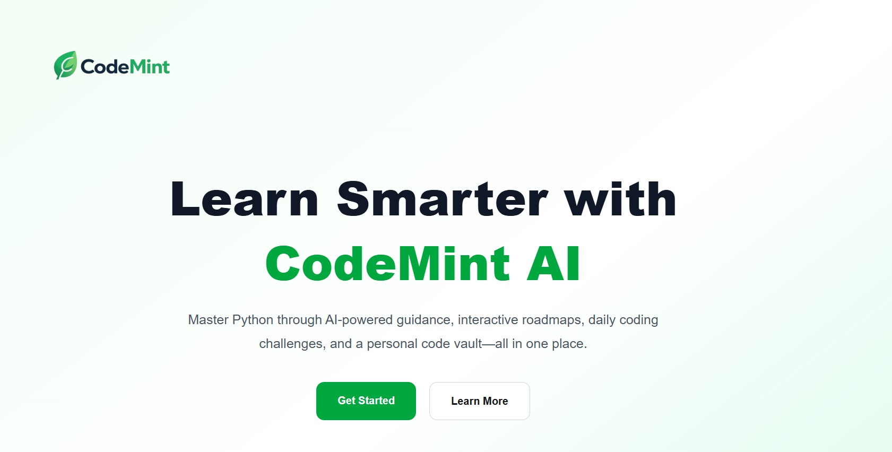
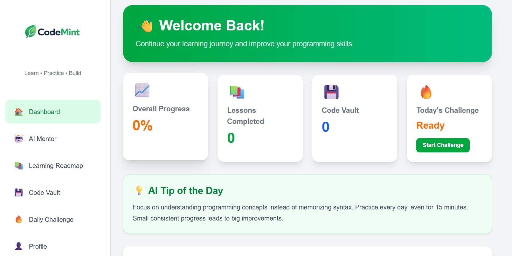
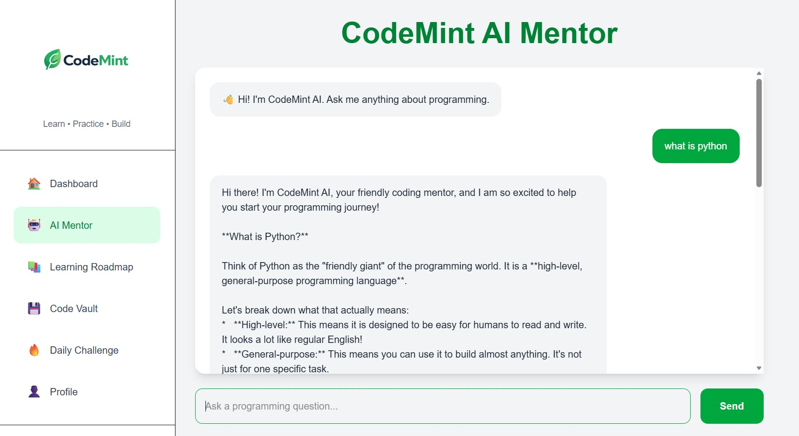
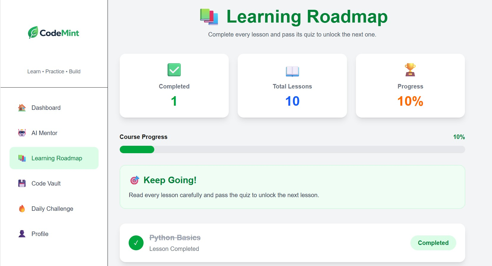
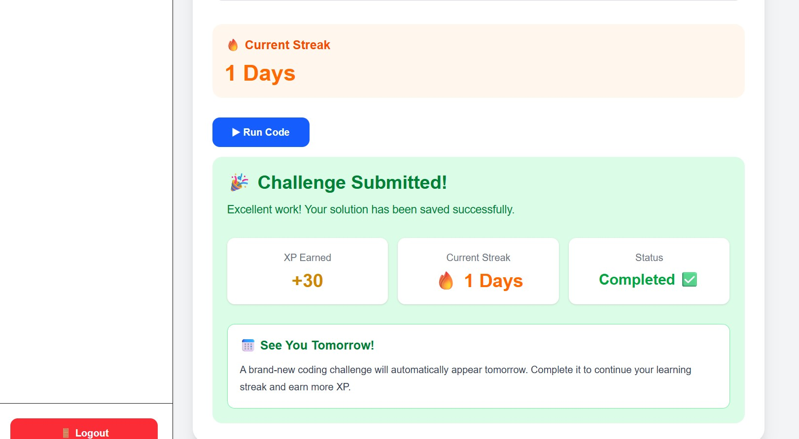
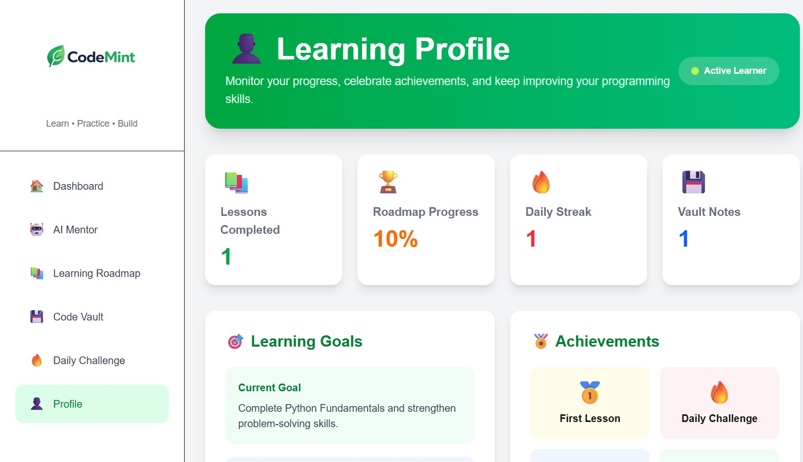

# 🌿 CodeMint AI

An AI-powered coding learning platform that helps beginner programmers learn, practice, and organize programming knowledge in one place.

## 🎯 Problem Statement

Many beginner programmers struggle because they rely on multiple resources such as YouTube, documentation, AI tools, and handwritten notes. This makes learning confusing and difficult to manage.

**CodeMint AI** solves this problem by providing one platform where learners can study programming through structured lessons, receive AI guidance, practice quizzes, save coding notes, and track their learning progress.

## 📖 Project Overview

CodeMint AI is a beginner-friendly web application designed to make learning programming more organized and interactive.

The application combines AI assistance, structured learning resources, quizzes, progress tracking, and a personal Code Vault into a single platform, allowing users to learn more efficiently without switching between multiple tools.

---

## 🚀 Live Demo

### 🌐 Live Application

https://zippy-elf-24820f.netlify.app/

### 📂 GitHub Repository

https://github.com/alizashah-ai/codemint

---

## ✨ Features

### 🤖 AI Mentor

- AI-powered coding mentor
- Explains programming concepts in simple language
- Helps debug code
- Provides beginner-friendly examples
- Supports:
  - Python
  - Java
  - C++
  - JavaScript
  - HTML
  - CSS
  - SQL
  - Data Structures & Algorithms

### 🗺️ Learning Roadmap

- Structured Python learning path
- Progressive lesson unlocking
- Beginner-friendly learning flow

### 📖 Interactive Lessons

Each lesson includes:

- Clear explanations
- Programming examples
- Beginner-focused content

### 📝 Quiz System

- Interactive quizzes after lessons
- Reinforces learning through practice

### 💡 Code Vault

Users can save:

- Bugs
- Error messages
- Solutions
- Programming notes

All information is stored locally using browser Local Storage.

### 📅 Daily Coding Challenge

Provides coding practice to encourage consistent learning.

### 📊 Dashboard

Displays:

- Learning shortcuts
- Progress overview
- AI Tip of the Day

### 👤 Profile

Displays:

- Completed lessons
- Saved notes
- Learning statistics
- Progress summary

---

## 🧠 AI Feature

CodeMint AI uses the **Google Gemini API** to power its AI Mentor.

The AI is designed to provide beginner-friendly programming assistance.

### AI Instructions (Prompt)

The AI follows these instructions:

- Help beginners learn programming.
- Explain concepts in simple language.
- Give beginner-friendly examples.
- Help debug code.
- Support Python, Java, C++, JavaScript, HTML, CSS, SQL and Data Structures & Algorithms.
- Politely refuse unrelated questions and only answer programming-related topics.

These instructions were specifically written for CodeMint AI to ensure educational and focused responses.

---

## 🛠 Technologies Used

### Frontend

- Next.js
- React
- TypeScript
- Tailwind CSS

### Backend

- Next.js API Routes

### Artificial Intelligence

- Google Gemini API
- @google/genai SDK

### Deployment

- Netlify

### Version Control

- Git
- GitHub

### Development Environment

- Visual Studio Code

---

## 📸 Screenshots

### Landing Page


### Dashboard


### AI Mentor


### Learning Roadmap


### Daily Progress


### User Profile


---

## ⚙️ How to Run the Project

Clone the repository:

```bash
git clone https://github.com/alizashah-ai/codemint.git
```

Move into the project directory:

```bash
cd codemint
```

Install dependencies:

```bash
npm install
```

Run the development server:

```bash
npm run dev
```

Open the application:

```
http://localhost:3000
```

---

## 🔑 Environment Variables

Create a `.env.local` file and add:

```env
GEMINI_API_KEY=YOUR_API_KEY
```

> **Note:** Never commit your real API key or any sensitive credentials to GitHub. Store them securely using environment variables.

---

## 🔮 Future Improvements

- User Authentication
- Cloud Database Integration
- Online Progress Synchronization
- Achievement Badges
- Leaderboard
- Dark Mode
- Mobile Application
- Additional Learning Paths

---

## 👩‍💻 Developer

**Aliza Shah**

Computer Science Student

Sukkur IBA University

GitHub: https://github.com/alizashah-ai

---

## ✅ Project Status

Completed and successfully deployed as the final project for the **AI Application Development** course.
